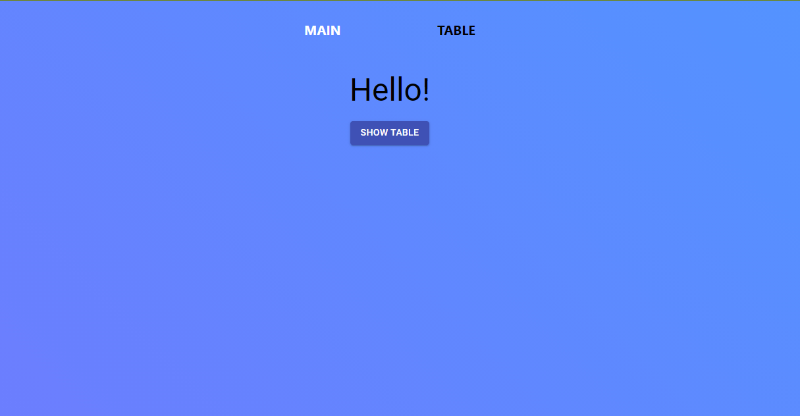
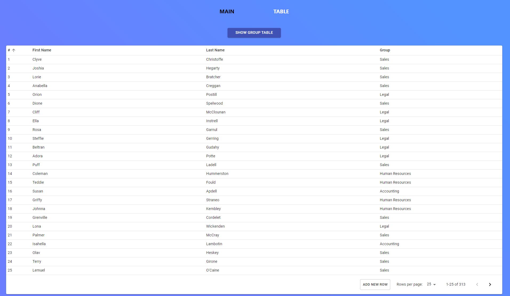
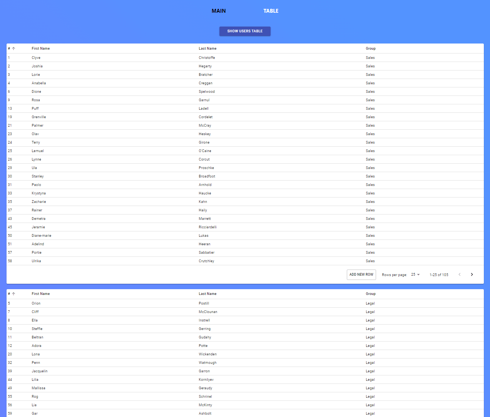

# Material UI test Table

  
See screenshots here

****

### Trying Mateial UI. Made with React, TypeScript and, yes, Material UI.

* There is a Main page, from witch you can navigate to the tables
* Next there is a General table with all the users
* And there is a Groups table, with few subtables sorted by group
* Sort columns by clicking at the table header
* Add new row by clicking "Add new row" button

****
### You need to start the local server before trying the application.
See instructions below.

****

### How to try?
* Clone repo: `git clone`  https://github.com/BakaBokka/Material-UI-test-Table.git
* Set dependencies: `npm i`
* Starts mock-json-server on the localhost: `npm run mock:api`
* Runs the app in the development mode on the local server: `npm start`

****

